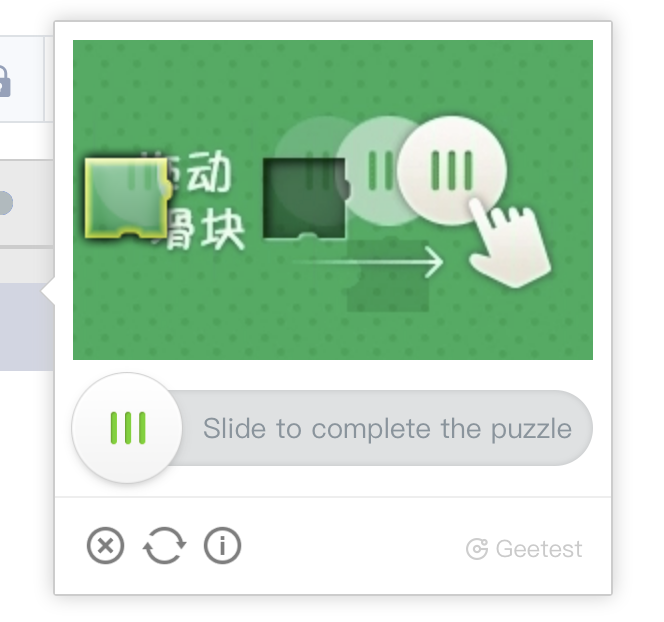
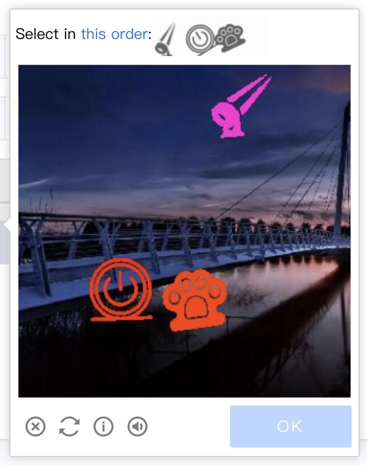
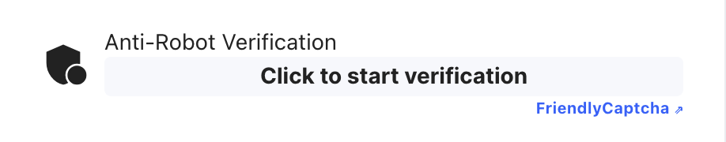

# Captcha Bypass APIs
Be sure to join [our Discord](https://takionapi.tech/discord) for a free trial key, questions and support.


We offer solution for different captchas!

## Table of Contents
- [Captcha Bypass APIs](#captcha-bypass-apis)
  - [Table of Contents](#table-of-contents)
  - [GeeTest](#geetest)
    - [Implementation](#implementation)
  - [Friendly Captcha](#friendly-captcha)
    - [Implementation](#implementation-1)
  - [Image Based Captchas](#image-based-captchas)
  - [Other captchas](#other-captchas)

## GeeTest

GeeTest is a popular CAPTCHA provider used by many websites to verify that users are human. It often presents a sliding puzzle that users need to solve to prove they're not bots. This type of CAPTCHA is known for its effectiveness in distinguishing humans from bots, but it can also pose a challenge when you're trying to automate interactions with GeeTest-protected websites.

 | 

Our API is designed to solve these puzzles quickly and accurately, allowing you to bypass GeeTest CAPTCHAs with ease. This can be particularly useful if you're developing a web scraper or automation tool that needs to interact with websites protected by GeeTest.

### Implementation

**Example request**
```
https://takionapi.tech/geetest/<gt>/<challenge>?api_key={YOUR_API_KEY}
```

**Example Response**
```json
{
    "geetest_challenge": "5ebe62d44bdbfba04f982ff334c2f454", 
    "geetest_validate": "8407b7159a1c3424744dc4c3bb760fc4", 
    "geetest_seccode": "8407b7159a1c3424744dc4c3bb760fc4|jordan"
}
```

Check out [geetest.py](./geetest.py) for an example solving and implementation

## Friendly Captcha

FriendlyCaptcha introduces a method that's both user-friendly and less intrusive. It's built on the idea of being environmentally friendly, using minimal proof-of-work tasks based on user interactions to verify authenticity. This system is crafted to enhance the user experience, aiming to remove the common irritations associated with captcha resolution, while prioritizing accessibility and inclusivity.



We offer a quick and easy solution for it as well, but the captcha is so easy to solve that we dedicated a [blog post](https://blog.takionapi.tech/friendlycaptcha/) and [open sourced](https://github.com/glizzykingdreko/FriendlyCaptcha-Solver) a solution for it. Feel free to use the apis if you prefer.

### Implementation

**Example request**
```
https://takionapi.tech/friendlycaptcha?puzzle=<puzzle>&api_key={YOUR_API_KEY}
```

**Example Response**
```json
{
    "puzzle": "ZeqM2gdbzRU63mixAQwtjwAAAAAAAAAAAJXudj2dEYc=", 
    "solution": "1e04711f0d5f976ee048f3b8558..."
}
```
Check out [friendlycaptcha.py](./friendlycaptcha.py) for an example solving and implementation

## Image Based Captchas

For the captchas based on images, like the one used from Queue-IT and Ticketmaster.sg check [Image aptchas Docs](./image/README.md)


## Other captchas

You need help with other type of captchas? Fell free to reach us on [our Discord](https://takionapi.tech/discord), we can make a solution for it.