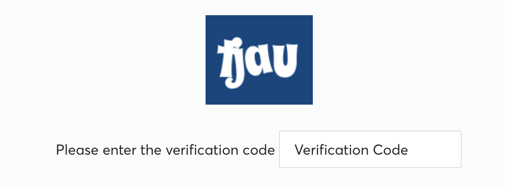

# Image Based Captchas
Be sure to join [our Discord](https://takionapi.tech/discord) for a free trial key, questions and support.

Some captchas are based on text displayed in a tricky way inside an image. We have a well trained Machine Learning model ready to solve all of them with a 100% success rate. Here's some examples


## Table of Contents
- [Image Based Captchas](#image-based-captchas)
  - [Table of Contents](#table-of-contents)
  - [The API](#the-api)
    - [Implementation](#implementation)
  - [Ticketmaster Singapore](#ticketmaster-singapore)
  - [Queue IT Captcha (BotDetect)](#queue-it-captcha-botdetect)
  - [Having issue with your captcha?](#having-issue-with-your-captcha)

## The API
We have one endpoint that works universally for images OCR. By passing an image as base64 string, it will return a JSON containing the extracted text

### Implementation

**Example Request (CURL)**
```bash
curl --request POST \
  --url 'https://takionapi.tech/ocr' \
  --header 'Content-Type: application/json' \
  --header 'x-api-key: YOUR_API_KEY' \
  --data '{
	"image": "/9j/4AAQSkZJRgABAQAA..."
}'
```

**Example Response**
```json
{
    "response": "AV2K20"
}
```


## Ticketmaster Singapore
[Ticketmaster SG](https://ticketmaster.sg/) requires a captcha before performing some actions like adding a ticket to the cart or accessing some events's pages.

 

Simply send it to our API as a base64 string and'll quick the *verification code* in few milliseconds.

Check out [ticketmaster_sg.py](./ticketmaster_sg.py) for an example script

## Queue IT Captcha (BotDetect)
Queue IT offers to their clients to use their own Captcha solution, known as **BotDetect** as well.
It is an image based captcha, that you cna easly solve with our APIs.

 

Check out [queueit.py](./queueit.py) for an example script

Or open our [live test demo](https://takionapi.tech/ocr/test/queueit) that will load and solve a Queue-IT captcha each reload.

## Having issue with your captcha?
We can fine tune our ML model in order to quickly work for you as well. Contact us [on our Discord](https://takionapi.tech/discord)