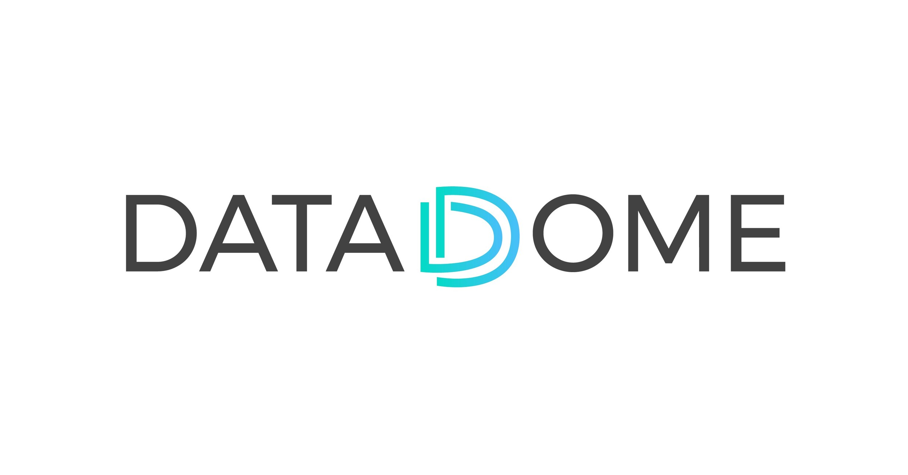
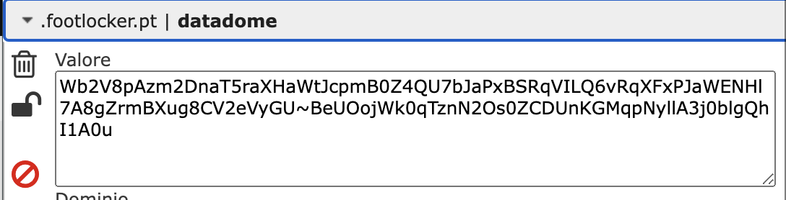
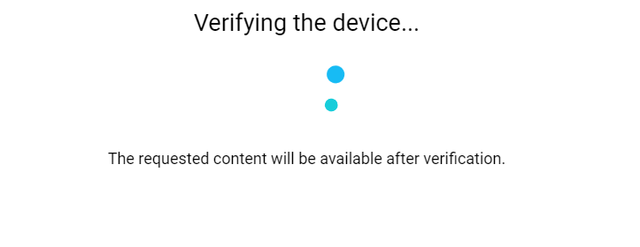

# Datadome Bypass APIs
Be sure to join [our Discord](https://takionapi.tech/discord) for a free trial key, questions and support.



Datadome is a bot management system that protects websites from automated threats, including scraping, credential stuffing, and layer 7 (application layer) DDoS attacks.

It's known for its inefficiency in detecting and blocking bots, resulting in false positives and IP bans for legitimate users.

Therefore, it's advisable to have a robust proxy list to rotate IPs and avoid IP bans.

## Table of Contents
- [Datadome Bypass APIs](#datadome-bypass-apis)
  - [Table of Contents](#table-of-contents)
  - [How Datadome Works](#how-datadome-works)
    - [Challenge response](#challenge-response)
    - [Challenges](#challenges)
      - [Slide Captcha](#slide-captcha)
      - [Interstitial](#interstitial)
  - [Some websites using it](#some-websites-using-it)
  - [Our API](#our-api)
    - [Build the challenge URL](#build-the-challenge-url)
    - [Solve the challenge](#solve-the-challenge)
    - [Example](#example)

## How Datadome Works
In order to access a Datadome website under protection you may need on first join or after some requests to solve a challenge that will generate you a `datadome` cookie that will garant you the access to the website for a certain amount of time. So if you see that a webite has a `datadome` cookie, you can be sure that it's using Datadome.



Is **required** to use TLS when interacting with a Datadome website.

### Challenge response
When you try to access a website protected by Datadome, you may receive a response with a status code `403` and a body containing a strange html, let's take a look into it:

```html
<html>
    <head>
        <title>footlocker.pt</title>
    </head>
    <body style="margin:0">
        <p id="cmsg">Please enable JS and disable any ad blocker</p>
        <script data-cfasync="false">
            var dd = {
                'rt': 'i',
                'cid': 'AHrlqAAAAAMAxVzL7Hc0p40AWXJFuQ==',
                'hsh': 'A55FBF4311ED6F1BF9911EB71931D5',
                'b': 1239798,
                's': 17434,
                'host': 'geo.captcha-delivery.com'
            }
        </script>
        <script data-cfasync='false'>
            (function() {
                // ...
            }
            )();
        </script>
        <script data-cfasync="false" src="https://interstitial.captcha-delivery.com/i.js"></script>
    </body>
</html>
```

The imporant thing here is the `dd` dict, that is used in order to build the challenge URL.
Based on the `rt` value you can already know what kind of challenge you are going to face:

- `i` - interstitial
- `c` - captcha slide

### Challenges

#### Slide Captcha
The slide captcha is a challenge that requires you to solve a slide captcha (aka GeeTest) in order to get the `datadome` cookie. This challenge is the most common and is used by most of the websites protected by Datadome.


#### Interstitial
The newest challenge, based on device verification, is the interstitial. Based on the website settings, you may see just a blank page or the "Verify your device" text.



## Some websites using it
Most of the tickets websites are using Incapsula to protect their website. Here are some examples of websites using Incapsula and the cookies/challenge they require:

| Website |
| --- |
| [footlocker.pt](https://www.footlocker.pt) (and all other domains) |
| [hermes.com](https://www.hermes.com) |
| [ticketing.liverpoolfc.com](https://ticketing.liverpoolfc.com) |
| [ticketing.manutd.com](https://ticketing.manutd.com) |
| [tickets.mancity.com](https://tickets.mancity.com) |
| [seatgeek.com](https://www.seatgeek.com) |
| ... |


## Our API
Our API is designed to facilitate smooth and effortless navigation through Datadome-protected websites and solve all of their challenges. 

### Build the challenge URL
**Endpoint** `https://datadome.takionapi.tech/build`

**Method** `POST`

**Body** 
```json
{
    "html": "<html><head><title>footlocker.pt</title><style>#cmsg{animation: A 1.5s;}@keyframes A{0%{opacity:0;}99%{opacity:0;}100%{opacity:1;}}</style></head>...<scrip>var dd={'rt':'i','cid':'AHrlqAAAAAMAs_1XaN_7uEIAWXJFuQ==','hsh':'A55FBF4311ED6F1BF9911EB71931D5','b':1239798,'s':17434,'host':'geo.captcha-delivery.com'}</script>...</html>",
    // pass the content of the block html response
    "datadome": "...",
    // your session's datadome's cookie value
    "referrer": "https://..." 
    // The requested URL
}
```

**Response**
```json
{
    "url": "https://geo.captcha-delivery.com/interstitial/?initialCid=...",
    "challenge_type": "interstitial" // the type of challenge found
}
```

### Solve the challenge
No matter what challeng it is, one endpoint will handle and solve both!

After loading the challenge URL with your session, pass it to our API to either generate the payload for the cookie generation post, or directly solve the challenge and return the `datadome` cookie.

Check the [documentation](https://docs.takionapi.tech/datadome/docs) for more information.

**Endpoint** `https://datadome.takionapi.tech/solve`

**Method** `POST`

**Body** 
```json
{
    "html": "...",
    // the HTML of the challenge page
}
```

**Response**
(the request to execute with your session for the cookie generation)
```json
{
    "url": "https://geo.captcha-delivery.com/...",
    "payload": "...",
    "headers": {...},
    "method": "POST"
}
```

### Example
Here's an example implementation of our Datadome API in Python:
 - [example](./example.py)

Get also a [free API key](https://takionapi.tech/discord) to start using our API.
