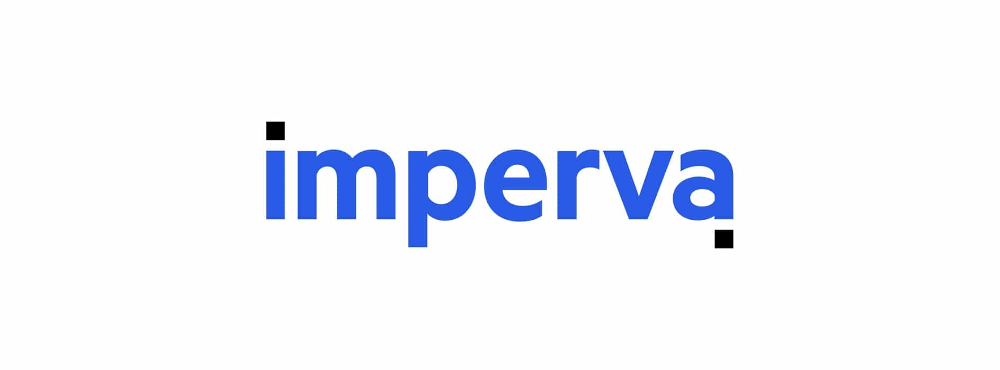
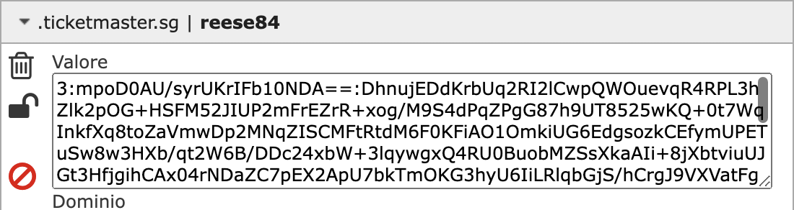
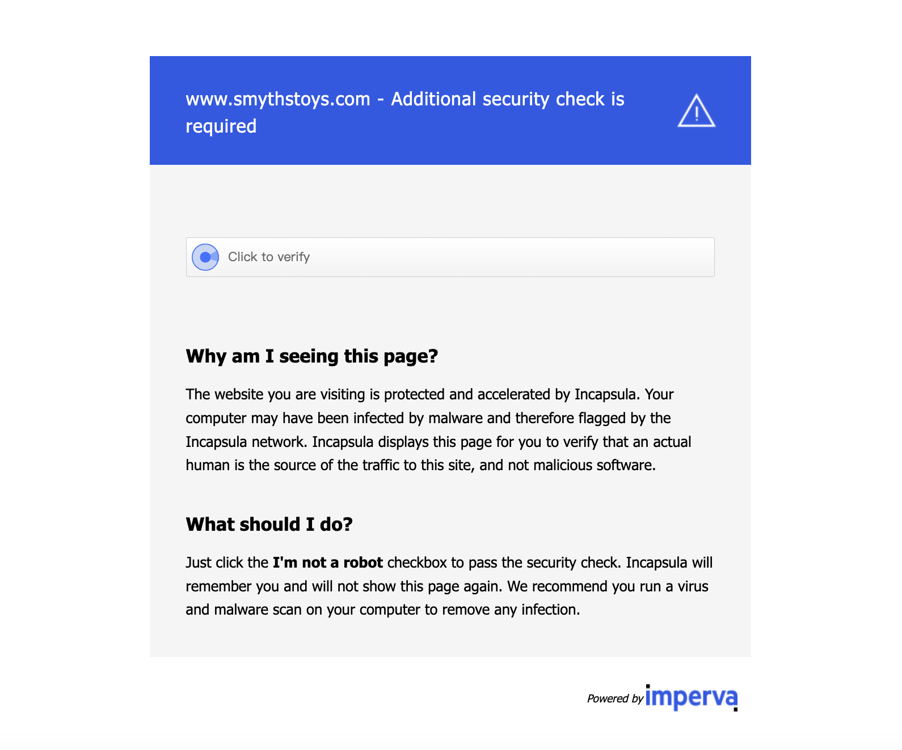

# Imperva / Incapsula Bypass APIs
Be sure to join [our Discord](https://takionapi.tech/discord) for a free trial key, questions and support.

Incapsula, now known as Imperva, is a robust Web Application Firewall (WAF) designed to safeguard websites against various attacks, including DDoS. It employs advanced security measures to block traffic that does not resemble human behavior. 

## Table of Contents
- [Imperva / Incapsula Bypass APIs](#imperva--incapsula-bypass-apis)
  - [Table of Contents](#table-of-contents)
  - [How Incapsula Works](#how-incapsula-works)
  - [Incapsula cookies](#incapsula-cookies)
    - [reese84](#reese84)
    - [\_\_\_utmvc](#___utmvc)
  - [Incapsula WAF](#incapsula-waf)
  - [Some websites using it](#some-websites-using-it)
  - [Our API](#our-api)
    - [Important things about Incapsula / Imperva](#important-things-about-incapsula--imperva)
    - [Examples](#examples)

## How Incapsula Works
Incapsula's firewall functions as a mediator between the client and the server. When a user attempts to access a website protected by Incapsula, the WAF intercepts the request, scrutinizes it, and then sends a new request to the source server to fetch the content.

## Incapsula cookies
Websites protected by Incapsula often require specific cookies to allow navigation. Incapsula primarily works with two types of cookies: the `___utmvc` cookie and the Reese84 cookie. Depending on the website, you may need to have a valid Reese84 cookie, a valid `___utmvc` cookie, or both.

### reese84
This cookie is generated using a valid, encrypted payload. Some websites require this cookie for navigation. Our API provides an endpoint to generate a valid Reese84 cookie, either by generating just the payload or directly creating the cookie.

### ___utmvc
This cookie checks for soe browser information. Some websites use this cookie for navigation.

## Incapsula WAF
Incapsula recently introduced removed the old WAF for reese84's websites (that right now gets a direct block), with a new different type. This one is based on the [GeeTest captcha](https://www.geetest.com/). It present only on some websites that uses the `___utmvc` cookie, for example the SmythsToys website.

Differently from the other challenge, is going to be required only the GeeTest captcha token. And will set you some `incap_sh_xxx` cookies.

## Some websites using it
Most of the tickets websites are using Incapsula to protect their website. Here are some examples of websites using Incapsula and the cookies/challenge they require:

| Website | reese84 | ___utmvc | waf |
| --- | --- | --- | --- |
| [ticketmaster.com](https://www.ticketmaster.com) (and other US domains) | ✅ | | |
| [ticketmaster.co.uk](https://www.ticketmaster.co.uk) (and other EU domains) | ✅ | |  |
| [tickets.rolandgarros.com](https://tickets.rolandgarros.com) | | ✅ |  |
| [smythstoys.com](https://www.smythstoys.com) | ✅ | ✅ | ✅ |
| [eticketing.co.uk](https://www.eticketing.co.uk) | ✅ |  |  |

## Our API
Our API is designed to facilitate smooth and effortless navigation through Incapsula-protected websites. We offer several endpoints to help you generate the necessary cookies and solve any challenges you might encounter. Whether you're dealing with the `reese84` challenge, the `___utmvc` challenge, both or their WAFs, our API has you covered.

Check out our [documentation](https://docs.takionapi.tech/incapsula/incapsula-documentation) to learn more about our Incapsula API.

### Important things about Incapsula / Imperva
- Is suggested to always use a **TLS** client
- Generate the payloads/cookies from our APIs by passing the same `User-Agent` and `Sec-Ch-Ua` headers you are using in your session, for a smooth and always good cookie!

### Examples
Here are some examples of how to use our API to generate the necessary cookies and solve the challenges:
 - [reese84 generation](./reese84.py)
 - [___utmvc generation](./___utmvc.py)
 - [WAF](./waf.py) (we solve GeeTest with our APIs)
 - [Ticketmaster SG Login](./ticketmaster_sg_login.py) Provided an example login flow for Ticketmaster SG with reese84 solving and the new implemented AWS Cognito

Get also a [free API key](https://takionapi.tech/discord) to start using our API.
